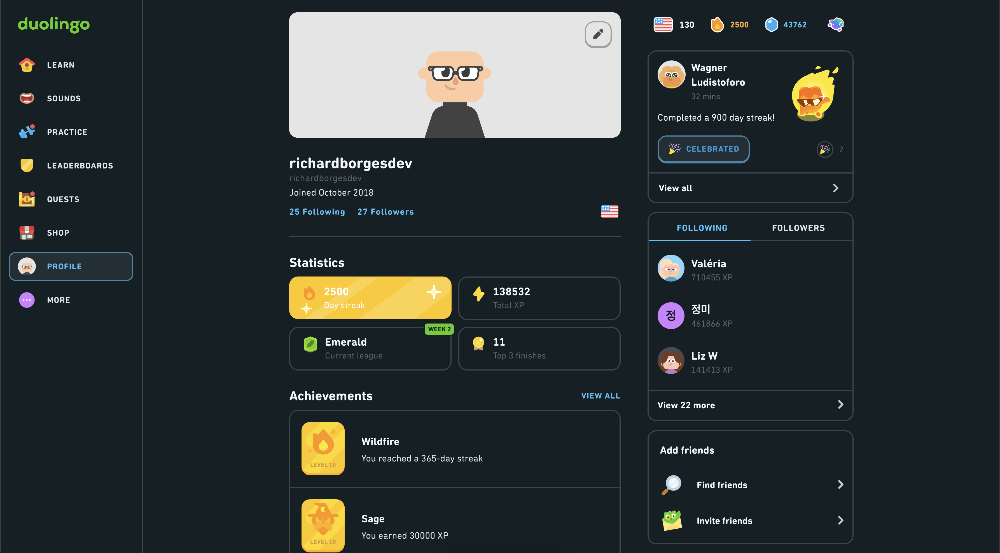
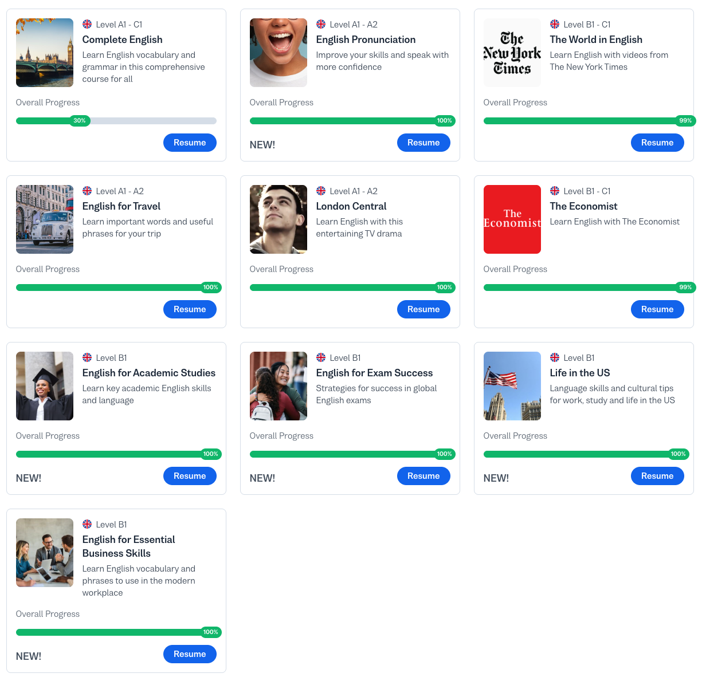

# english-hub

## Tasks
- [X] Duolingo | Finish at 2500 days
- [X] Busuu | Finish all extra courses
- [ ] Busuu | Finish main course
- [X] Create my own grammar review
- [ ] DET | 120+ points
- [ ] TOEFL | 100+ points
- [ ] IELTS | 7.5+ points

## Duolingo
1. https://www.duolingo.com/profile/richardborgesdev

## Busuu
1. https://www.busuu.com

## DET | Duolingo English Test
1. https://englishtest.duolingo.com/home
1. https://www.youtube.com/@TeacherLuke-DET

## TOEFL | Test of English as a Foreign Language
1. https://www.ets.org/toefl.html
1. https://www.youtube.com/@TOEFL_test_with_LinguaTrip
1. https://www.youtube.com/@TSTPrep

## IELTS | International English Language Testing System
1. https://ielts.org/
1. https://youtube.com/@ieltsadvantage

## From Brazil
1. https://www.youtube.com/@mairovergara
1. https://www.youtube.com/@MatheusWernerJerke
1. https://www.youtube.com/@teacher.thiagoalencar

## Learning Process
1. https://www.youtube.com/@veronikas.languagediaries
1. https://www.youtube.com/@linguamarina

## Grammar
1. https://www.perfect-english-grammar.com/grammar-explanations.html
1. https://www.udemy.com/course/learn-english-grammar-online/
v
## Pronunciation
1. https://www.youtube.com/@hadar.shemesh
1. https://youtube.com/@rachelsenglish
1. https://www.udemy.com/course/english-pronunciation-master-education

## Short Stories
1. https://youtube.com/@carokowanzenglish

## Podcasts
1. https://americanenglishpodcast.com

## TEFL | Teaching English as a Foreign Language.
1. https://www.tefl.org/

## Progress

### Duolingo | 2500 Days Streak Achievement! 🔥

### Busuu | All Extra Courses Completed! 🎓

